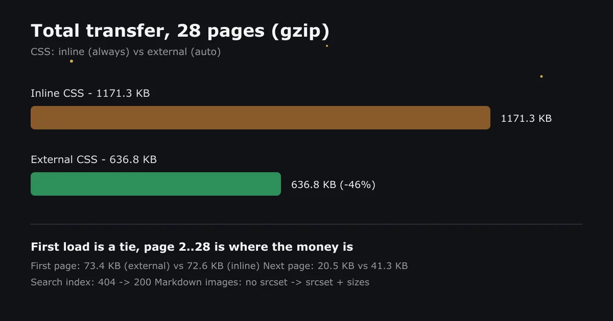

优化博客这件事，最怕的不是不知道怎么改，而是**改完不知道有没有用**。这篇把最近几轮改动按实测数据记下来，每一条都有前后对比。

## 先看结论

28 个页面的 gzip 传输量对比（外链 CSS vs 内联 CSS）：



- 全站合计：**636.8 KB vs 1171.3 KB**，外链方案省 46%
- 首屏几乎打平：73.4 KB vs 72.6 KB
- 差距在第二页开始拉开：20.5 KB vs 41.3 KB

## 一、CSS 内联还是外链

内联 CSS 的唯一优势是少一个阻塞 RTT（Lighthouse 慢速 4G 估算约 -260ms）。代价是每一页都重复携带那 30KB 样式。

关键在于本站用 Swup 做客户端切页：CSS 只在首次访问时下载一次，之后长期命中强缓存。**翻页场景下外链是明显赢家**，所以最终配置保持 `css: "auto"` 外链，内联方案实测后放弃。

| | 首次访问首页 | 之后每页 | 全站合计 |
| --- | --- | --- | --- |
| 外链 (auto) | 73.4 KB | 20.5 KB | **636.8 KB** |
| 内联 (always) | 72.6 KB | 41.3 KB | 1171.3 KB |

## 二、Markdown 图片的响应式缺口

组件里的 `<Image>` 一直都有完整的响应式输出：

```html

```

但 Markdown 正文里的图片没有——`astro.config.mjs` 里 `image.layout: "none"` 把它关了，正文图只输出单一尺寸、不带 `srcset/sizes`。改成 Astro 5.10+ 的默认值：

```js
image: {
  layout: "constrained",   // 自动生成 srcset / sizes
  responsiveStyles: true,
},
```

改后正文图片输出：

```html

```

两个安全前提都验证过：注入样式在 `@layer astro.images` 里且用 `:where()` 包裹（零特异性，不会覆盖主题样式）；远程图床链接仍是 passthrough，构建期不下载图片，CI 不增加网络依赖。

## 三、字体子集化

中文 webfont 不做子集化基本不可用。构建流水线里的 `subset-fonts.ts` 按实际用到的字符生成子集，全量字体只留在本地，线上只传几十 KB 的子集文件。这一步是"没它不行"级别的。

## 四、构建后处理流水线

`pnpm run build` 实际是 8 步流水线，`astro build` 只是中间一步：

```log
generate-github-card-data → generate-lqips → generate-vndb-covers
→ astro build → prune-pio-assets → subset-fonts
→ minify-inline-scripts → run-pagefind
```

两个值得一提：

- **prune-pio-assets**：Live2D/Spine 素材里没被引用的贴图直接裁掉
- **minify-inline-scripts**：页面里内联的 `<script>` 构建后压缩，首页 HTML 从 148.5 KB 降到 132 KB

这也是为什么部署时构建命令必须是 `pnpm run build` 而不是 `npx astro build`——后者会跳过前后 7 步，之前就因为这个线上搜索直接 404 过。

## 五、LQIP 模糊占位

`generate-lqips.ts` 扫描 `src/` 和 `public/` 的所有图片，为每张图生成一个极小的渐变占位色。图片加载前先渲染占位色，加载完成后 500ms 淡入，视觉上没有"突然蹦出来"的感觉。封面容器统一走这个逻辑，加载中还有旋转 spinner 兜底。

## 六、缓存策略

`public/_headers` 里给不同资源分了三档：

| 资源 | 策略 |
| --- | --- |
| `/_astro/*`（带哈希） | `max-age=31536000, immutable` |
| `/pagefind/*` | 长缓存 |
| HTML | `max-age=0, must-revalidate` |

哈希文件名的内容永远不会变，一年强缓存是安全的；HTML 必须每次回源校验，否则改了文章访客看不到。

## 数据汇总

| 指标 | 优化前 | 优化后 |
| --- | --- | --- |
| 首页 HTML（gzip 后） | 148.5 KB | **132 KB** |
| 全站传输（28 页） | 1171.3 KB | **636.8 KB** |
| 站内搜索 | 404（索引缺失） | 200，6 页 / 321 词 |
| 正文图片 | 单一尺寸 | srcset + sizes |
| 中文字体 | 未子集化 | 按需子集 |

## 还没做的

- 三个巨型组件（播放器 775 行、日历 648 行、壁纸区 635 行）还没拆，收益主要是可读性，回归风险不小，留到单独一轮
- `/_astro/*` 响应头里发现过 `Cache-Control` 重复下发的问题，还需要跟进确认是哪一层叠加的

## 小结

性能优化没有一步是魔法，全是"量出来 → 改 → 再量"的循环。最有价值的一条经验：**每个优化项都在真实构建产物上验证过再上线**，凭感觉优化的部分，最后多半会被数据打脸。
