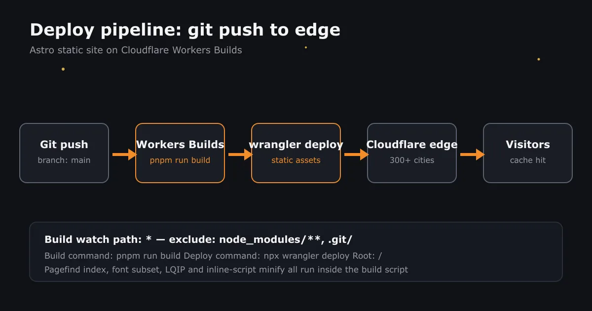

这个博客最终的托管形态是：**一个只有静态资源的 Cloudflare Worker**。没有 SSR、没有绑定、没有服务器——`dist/` 里的文件被推到 Cloudflare 边缘，访客请求全部命中 CDN 缓存。

## 整体架构

一次 `git push` 之后发生的事情：



整个链路里没有自己维护的构建机：Cloudflare 的构建容器负责跑 `pnpm run build`，产物直接经 `wrangler deploy` 推上线。

## 第一步：连接仓库

在 Dashboard 的 **Workers & Pages → 创建应用程序 → 导入存储库** 里选中 GitHub 仓库。这里有个官方文档特意标了 *Caution* 的要求：

> Worker 名称必须和 Wrangler 配置文件里的 `name` 一致，否则构建直接失败。

我的 Worker 叫 `web-xmore2025-astrofirefly-1008`，`wrangler.jsonc` 里的 `name` 保持一致即可。

## 第二步：构建设置

核心就三个字段：

| 字段 | 值 | 说明 |
| --- | --- | --- |
| 构建命令 | `pnpm run build` | 必须走完整流水线，见下文踩坑 ② |
| 部署命令 | `npx wrangler deploy` | |
| 根目录 | `/` | 仓库根就是项目根 |

仓库的 `preinstall` 是 `npx only-allow pnpm`，锁文件只有 `pnpm-lock.yaml`，所以构建命令必须用 pnpm。Node 版本不用在后台设置——Workers Builds 会读仓库根目录的 `.nvmrc`（我写的是 `22.23.0`），比默认的 Node 24 更可控。

构建监视路径保持默认即可：包含 `*`，排除 `node_modules/**` 和 `.git/`。

## 第三步：构建令牌（最容易翻车的一步）

Workers Builds 部署用的不是你自己的账号 API Token，而是给这个 Worker 单独签发的一枚**构建令牌**。它是可以失效的——失效的表现非常迷惑：

```log
18:51:58.258  Success: Finished initializing build environment
18:51:58.431  Failed: The build token selected for this build has been
              deleted or rolled and cannot be used for this build.
```

初始化 17 秒就失败，跟构建命令、依赖、Node 版本统统无关。修复方式：**设置 → Builds → API 令牌 → 新建**。如果手动创建自定义令牌，权限要给齐这 7 项：

| 权限 | 级别 |
| --- | --- |
| Workers 脚本 | 编辑 |
| 帐户设置 | 读 |
| Workers KV 存储 | 编辑 |
| Workers R2 存储 | 编辑 |
| Workers 路由（Zone 级） | 编辑 |
| 用户详细信息 | 读 |
| 成员资格 | 读 |

还有两处资源范围最容易被漏掉：**Account** 选自己的账号，**Zone** 必须包含站点所在域（或者干脆选 All zones）。权限对了、Zone 圈错了，更新自定义域时照样 403。

## 第四步：绑定自定义域

**设置 → 域 → 添加自定义域**，把 `web-admin.xmorexz.dpdns.org` 挂上去。走的是 Workers Domains 机制，证书自动签发，DNS 自动接管，不需要手动配 CNAME。

## 第五步：验证部署结果

上线后我习惯跑一组最小检查（Node 一行脚本就行）：

```js
const base = "https://web-admin.xmorexz.dpdns.org";
const check = async (p) => {
  const r = await fetch(base + p, { method: "HEAD" });
  console.log(p, "->", r.status, r.headers.get("cache-control"));
};
await check("/");                        // 首页
await check("/pagefind/pagefind.js");    // 搜索索引
await check("/sitemap-index.xml");       // 站点地图
```

三个都返回 `200`，才算部署成功。

## 踩坑实录

### ① 构建令牌被轮换

就是上面第三节那个报错。当时的上下文是清理过一次账号关联，令牌连带失效了。教训：**看到初始化阶段就失败，先怀疑令牌，别去改构建命令**。

### ② 构建命令少写了流水线

有一次后台把构建命令填成了 `npx astro build`——看起来"更直接"，实际跳过了 `package.json` 里 `build` 脚本的前后 7 个步骤：

```json
"build": "npx tsx scripts/generate-github-card-data.ts && npx tsx scripts/generate-lqips.ts && ... && astro build && ... && npx tsx scripts/run-pagefind.ts"
```

后果是线上**站内搜索直接坏了**：页面里还有搜索框，但 `/pagefind/*` 全部 404，点搜索一直转圈。字体子集化、内联脚本压缩也都没跑，首页 HTML 反而比正常版本大了 16KB。

### ③ favicon.ico 404 是正常的

本站用的是 `/favicon/firefly-32.png` 这套 PNG 图标，没有 `.ico` 文件。检查脚本里这一项报 404 不算故障。

## 小结

- 纯静态站点用 Workers 托管，静态资源请求**不计费**，这是比 Pages 时代更省心的形态
- 构建命令一定对齐 `package.json` 的 `build` 脚本，不要"抄近路"
- 构建令牌是独立生命周期，轮换后要记得在 Builds 设置里更新
- 每次部署后跑一遍 200 检查清单，别等访客告诉你搜索坏了
